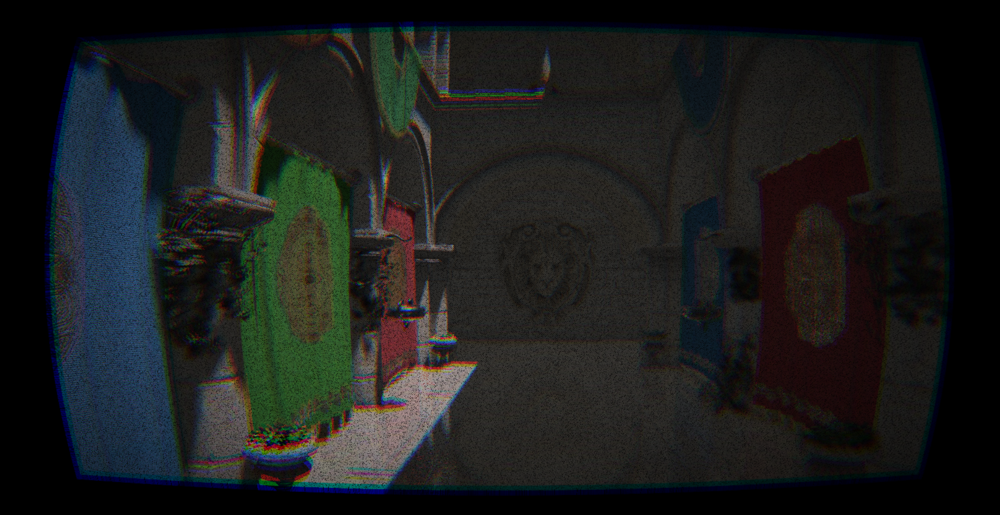
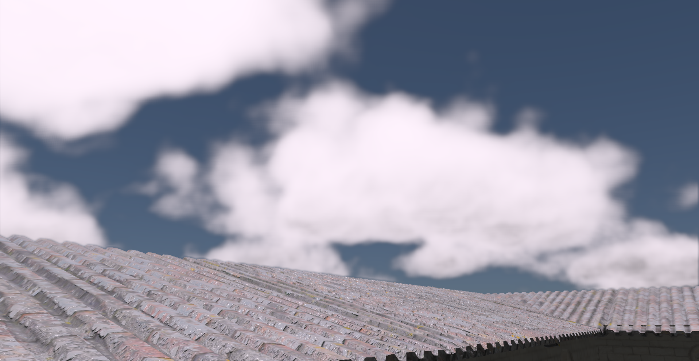
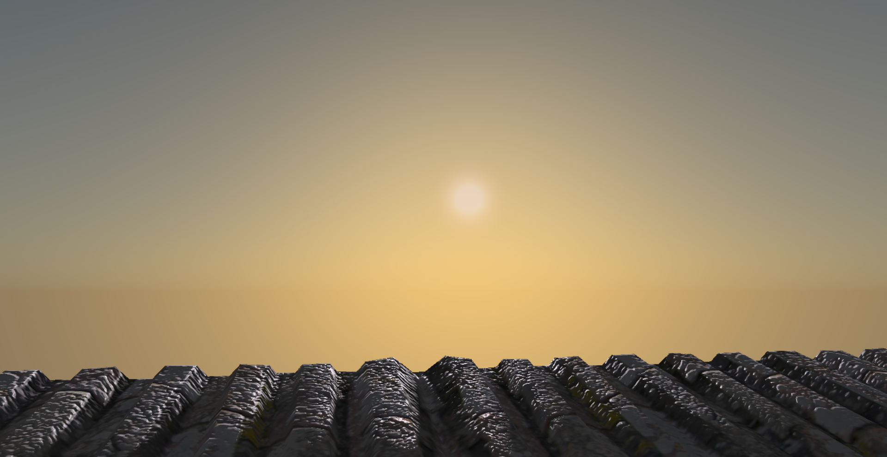
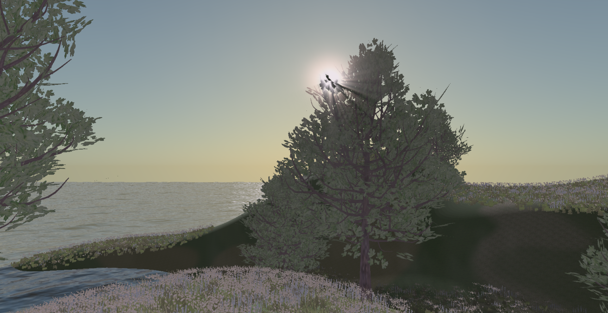
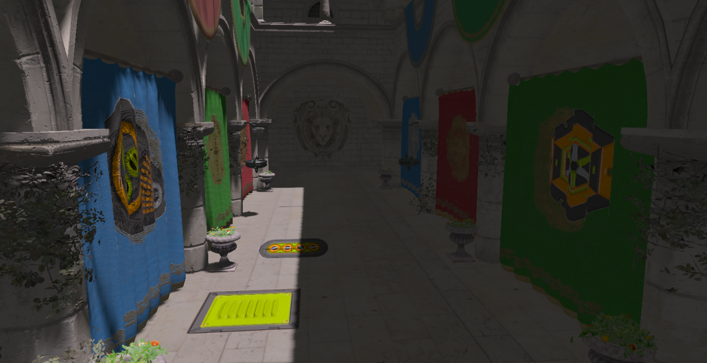
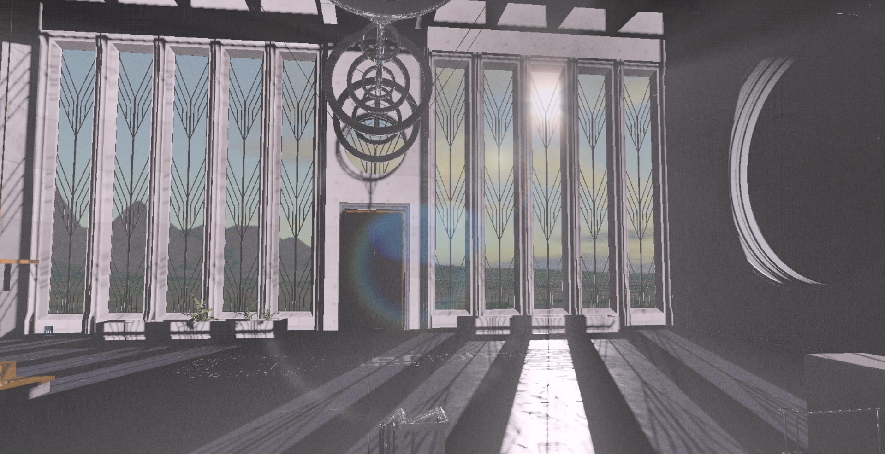

  

# Adria-DX11
Graphics engine written in C++/DirectX11.

## Features
* Tiled and Clustered deferred rendering 
* Physically based shading
* Shadows
    - PCF Shadows for directional, spot and point lights
    - Cascade shadow maps for directional lights
* Volumetric Lighting (2D Raymarching)
* HDR and Tone Mapping (Hable, Reinhard, Tony McMapface)
* Bloom
* Depth Of Field + Bokeh  
* Ambient Occlusion: SSAO, HBAO
* Film effects: Lens distortion, Chromatic aberration, Vignette, Film grain
* SSR
* Deferred decals
* Antialiasing: FXAA, TAA
* God rays
* Lens flare
* Fog
* Motion blur
* Volumetric clouds
* Ocean FFT
    - Adaptive tesselation
    - Foam
* Procedural terrain with instanced foliage and trees
* Hosek-Wilkie sky model
* Particles
* Editor
* Profiler
* Shader hot reloading

## Screenshots

<table>
  <tr>
    <td>Tiled Deferred Rendering with 256 lights</td>
     <td>Tiled Deferred Rendering Visualized</td>
     </tr>
  <tr>
    <td></td>
    <td></td>
  </tr>
 </table>
 
 Film Effects

 
Ocean and Lens Flare

 
 Volumetric Lighting

Bokeh

Volumetric Clouds

Hosek-Wilkie Sky Model

God Rays and Instanced Foliage

Deferred Decals

Brutalism

