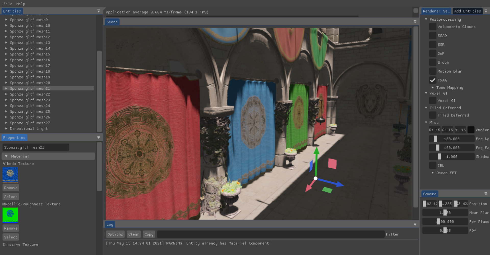
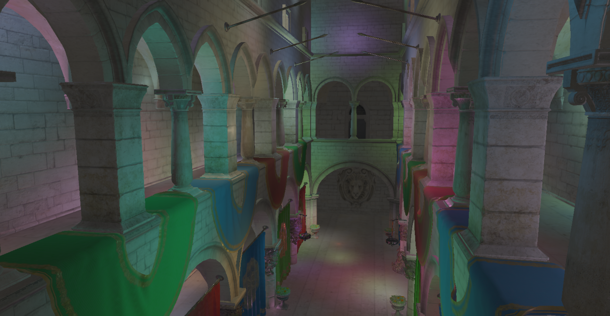
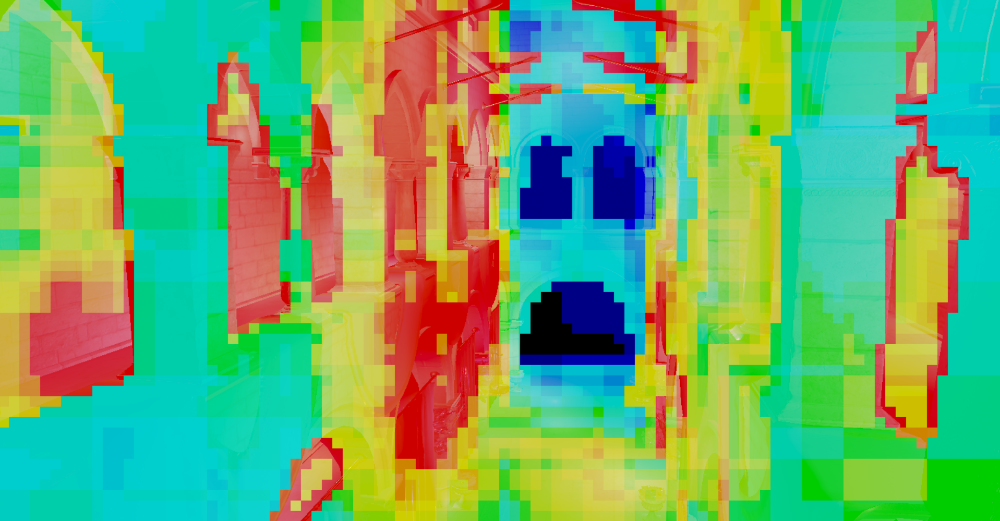
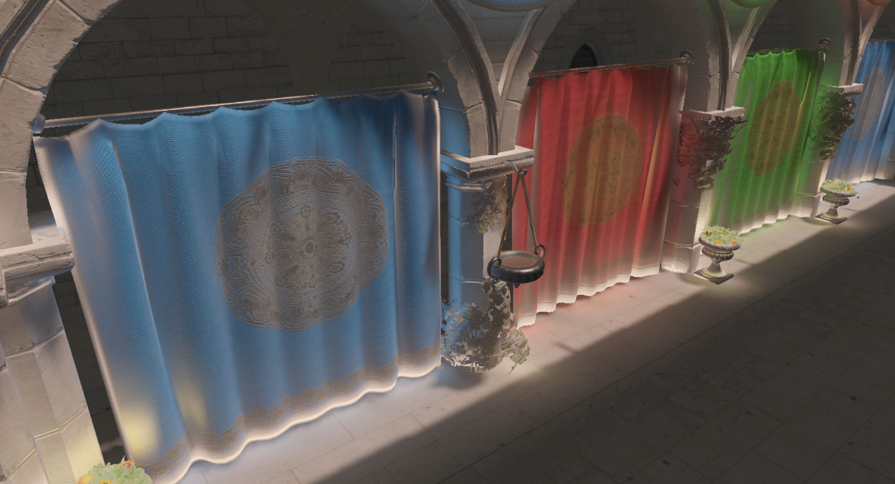
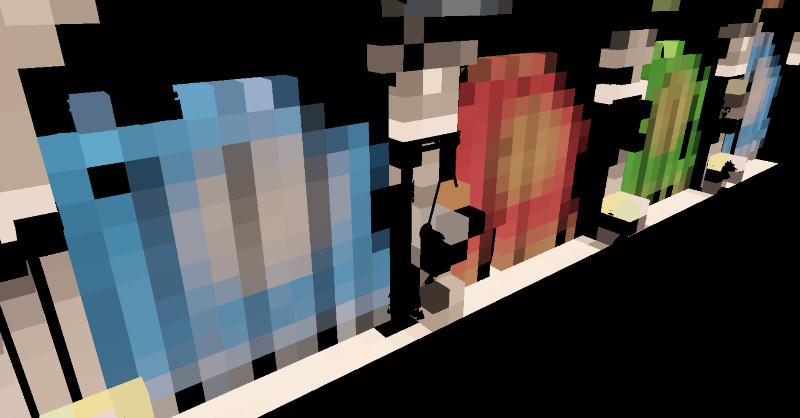
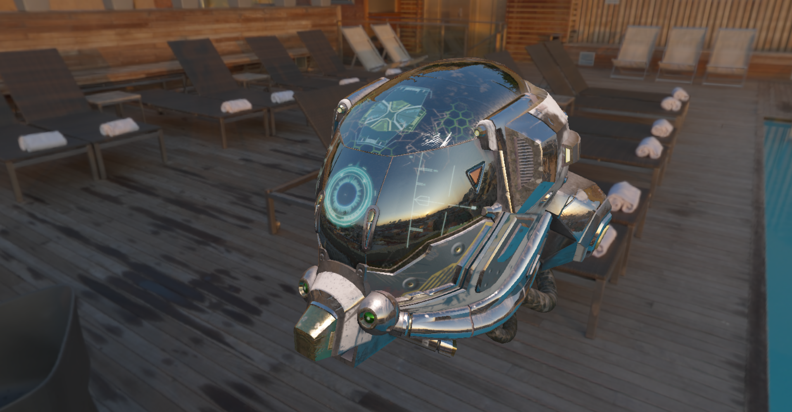
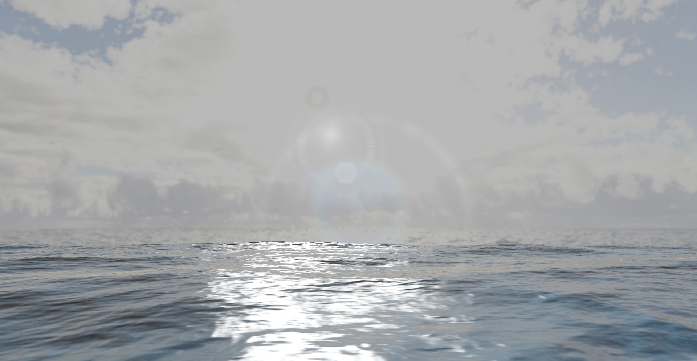
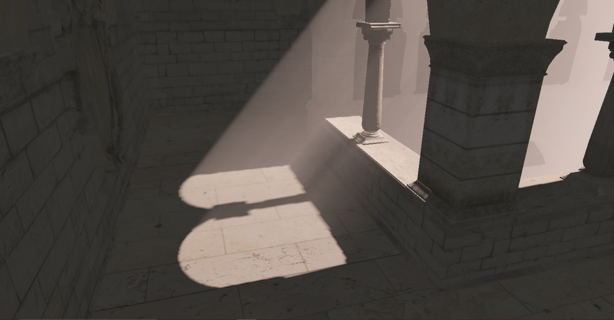
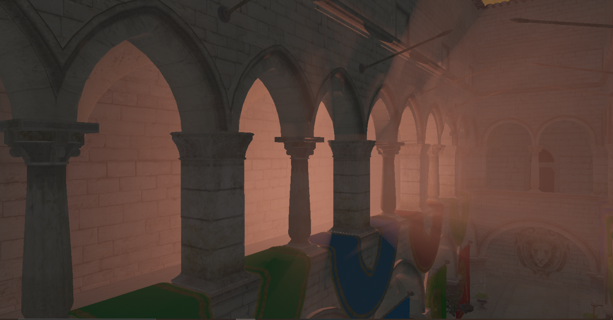
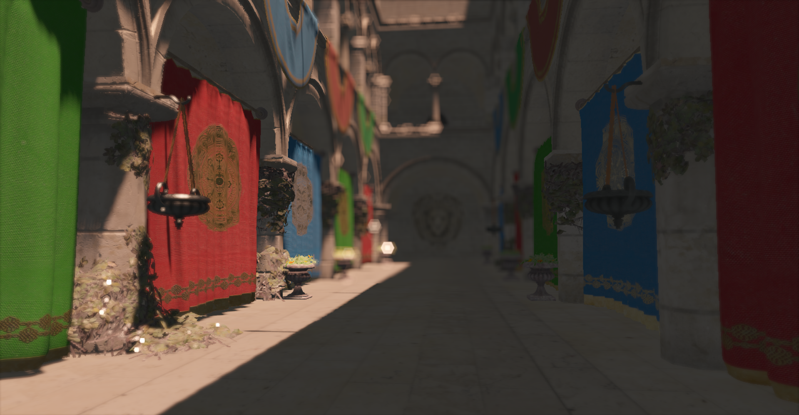

# Adria-DX11

Graphics engine written in C++/DirectX11.

## Features
* Entity-Component System
* Deferred + Forward Rendering 
* Tiled Deferred Rendering 
* Clustered Deferred Rendering
* Voxel Cone Tracing Global Illumination
* Physically Based Shading
* Image Based Lighting
* Normal Mapping
* Shadows
    - PCF Shadows for Directional, Spot and Point lights
    - Cascade Shadow Maps for Directional Lights
* Volumetric Lighting
    - Directional Lights with Shadow Maps
    - Directional Lights with Cascade Shadow Maps
    - Point and Spot Lights 
* HDR and Tone Mapping
* Bloom
* Depth Of Field + Bokeh  
    - Bokeh shapes supported - Hexagon, Octagon, Circle, Cross
* SSAO
* SSR
* FXAA
* TAA
* God Rays
* Lens Flare
* Fog
* Motion Blur
* Volumetric Clouds
* Ocean FFT
    - Adaptive Tesselation
    - Foam
* ImGui Editor
* Assimp Model Loading
* Profiler
* Camera and Light Frustum Culling

### To Do
* Atmospheric Scattering
* Terrain
* Particle Engine

## Dependencies
[assimp](https://github.com/assimp/assimp)

[ImGui](https://github.com/ocornut/imgui)

[ImGuizmo](https://github.com/CedricGuillemet/ImGuizmo)

[ImGuiFileDialog](https://github.com/aiekick/ImGuiFileDialog)

[stb](https://github.com/nothings/stb)

## Screenshots

Editor 

<table>
  <tr>
    <td>Tiled Deferred Rendering with 256 lights</td>
     <td>Tiled Deferred Rendering Visualized</td>
     </tr>
  <tr>
    <td></td>
    <td></td>
  </tr>
 </table>
 
 <table>
  <tr>
     <td>Voxel Cone Tracing Global Illumination</td>
     <td>Voxelized Scene</td>
     </tr>
  <tr>
    <td></td>
    <td></td>
  </tr>
 </table>
 
 Image Based Lighting 

 
Ocean and Lens Flare

 
 Volumetric Lighting

Bokeh

Volumetric Clouds and God Rays

